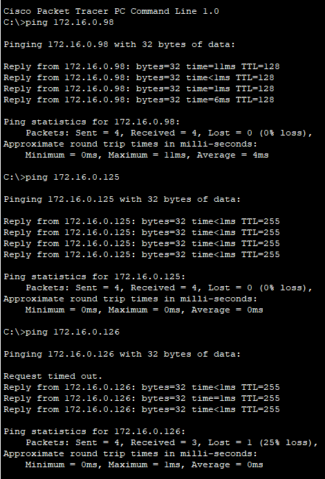
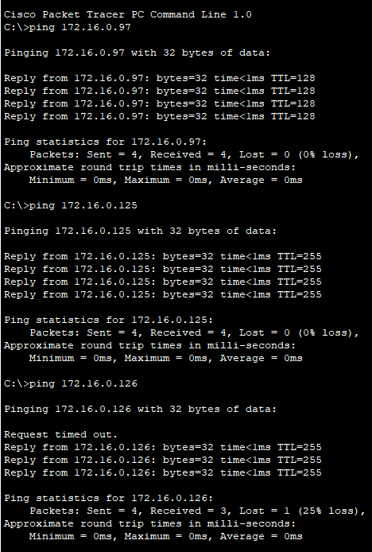

## Comprobación de conectividad

Se verificó que ambas PCs pueden comunicarse correctamente mediante ping:

| PC1                                         | PC2                                     |
|:-------------------------------------------------:|:-------------------------------------------------:|
|    |    |
|    |    |
