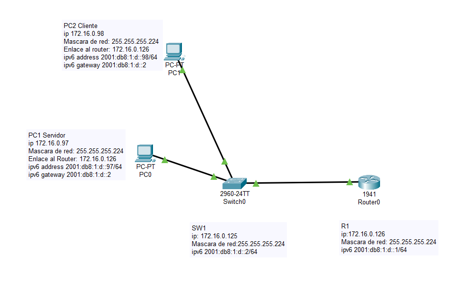
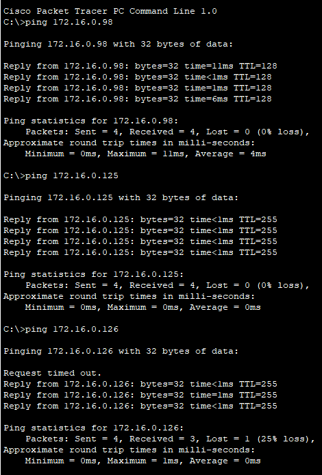
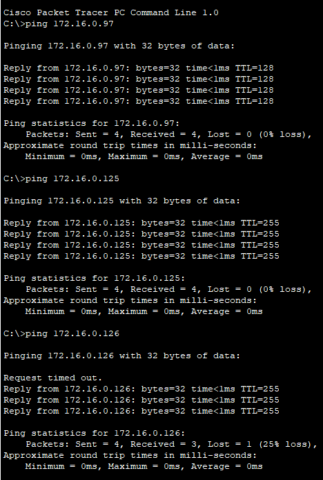

# JLaboratories — Configuración de Red y Despliegue

Este **README.md** describe la configuración de red y los pasos de despliegue para la aplicación JLaboratories en un entorno cliente-servidor sobre LAN.

---

## I. Problemática

En JLaboratories, el registro de órdenes de reparación, cotizaciones y datos de clientes se hacía de forma **manual (papel)**, lo cual provocaba:
- Pérdida frecuente de documentos físicos.
- Procesos de contabilidad e inventario lentos e ineficientes.
- Dificultad para consolidar cortes de operaciones al fin de mes.

---

## II. Propuesta de Solución

Digitalizar todo el flujo mediante:
- **Aplicación WinForms** cliente-servidor sobre SQL Server.
- **Generación automática** de tickets y exportación a PDF.
- **Dashboard** en tiempo real (Pending, Urgent, Completed).
- **IoT + Node-RED** para monitoreo de temperatura y humedad en el almacén.

---

## III. Implementación por Fases

1. **Análisis y Diseño**  
   - Definición de requisitos y casos de uso.  
   - Modelo de datos y diagrama ER.

2. **Desarrollo**  
   - Capa de datos: SQL Server, SPs, triggers.  
   - Capa de negocio: C#/.NET.  
   - Capa de presentación: WinForms con controles personalizados.

3. **Pruebas**  
   - Unitarias, integración y UAT.  
   - Validación de rendimiento (RAM ≤ 80 MB, CPU ≤ 30 %).

4. **Despliegue y Capacitación**  
   - Instalación en servidor (PC1) y clientes (PC2, PC3).  
   - Formación de usuarios (4 administradores, resto en modo lectura).

---

## IV. Desarrollo de la Red

### 1. Topología de Red



- **Router R1**: 172.16.0.61/27  
- **Switch SW1**: 172.16.0.62/27  
- **PC Servidor**: 172.16.0.97/27  
- **PC Cliente 1**: 172.16.0.98/27  
- **PC Cliente 2**: 172.16.0.99/27  

---

### 2. Segmentación con VLSM (/27)

- Subred: `172.16.0.32/27` (`255.255.255.224`)  
- Hosts útiles: `.33` … `.62`  
- Broadcast: `.63`  
- IPv6 global: `2001:db8:1:b::/64`  
- IPv6 link-local: `FE80::/10`  

---

### 3. Configuración del Switch (SW1)

```text
Switch> enable
Switch# configure terminal
Switch(config)# hostname SW1
SW1(config)# interface vlan 1
SW1(config-if)# ip address 172.16.0.62 255.255.255.224
SW1(config-if)# ipv6 address 2001:db8:1:b::2/64
SW1(config-if)# no shutdown
SW1(config)# sdm prefer dual-ipv4-and-ipv6 default
SW1(config)# service password-encryption
SW1(config)# username admin password cisco
SW1(config)# line vty 0 15
SW1(config-line)# transport input telnet ssh
SW1(config-line)# login local
SW1(config-line)# exit
SW1(config)# exit
Switch# write memory
``` 

### 4. Configuración del Router (R1)
```text
Router> enable
Router# configure terminal
Router(config)# hostname R1
R1(config)# interface gigabitEthernet0/0
R1(config-if)# ip address 172.16.0.61 255.255.255.224
R1(config-if)# ipv6 address 2001:db8:1:b::1/64
R1(config-if)# no shutdown
R1(config)# ipv6 unicast-routing
R1(config)# service password-encryption
R1(config)# username admin password cisco
R1(config)# crypto key generate rsa modulus 1024
R1(config)# line vty 0 4
R1(config-line)# transport input telnet ssh
R1(config-line)# login local
R1(config)# exit
Router# write memory
```

### 5. Configuración de las PCs

**IPv4**  
- **PC Servidor**: `172.16.0.97/27`  
- **PC Cliente1**: `172.16.0.98/27`  
- **Puerta de enlace**: `172.16.0.61`  

**IPv6**  
- **Servidor**: `2001:db8:1:b::97/64`  
- **Cliente1**: `2001:db8:1:b::98/64`  
- **Gateway IPv6**: `2001:db8:1:b::1`  

**Firewall Windows**  
- Permitir ICMP (ping) entrante.  
- Permitir TCP puerto **1433** (SQL Server).  

---

# V. Comprobación de Conectividad

| Origen → Destino   | Resultado          |
|--------------------|--------------------|
| PC1 → PC2 (ping)   |   |
| PC2 → PC1 (ping)   |   |
